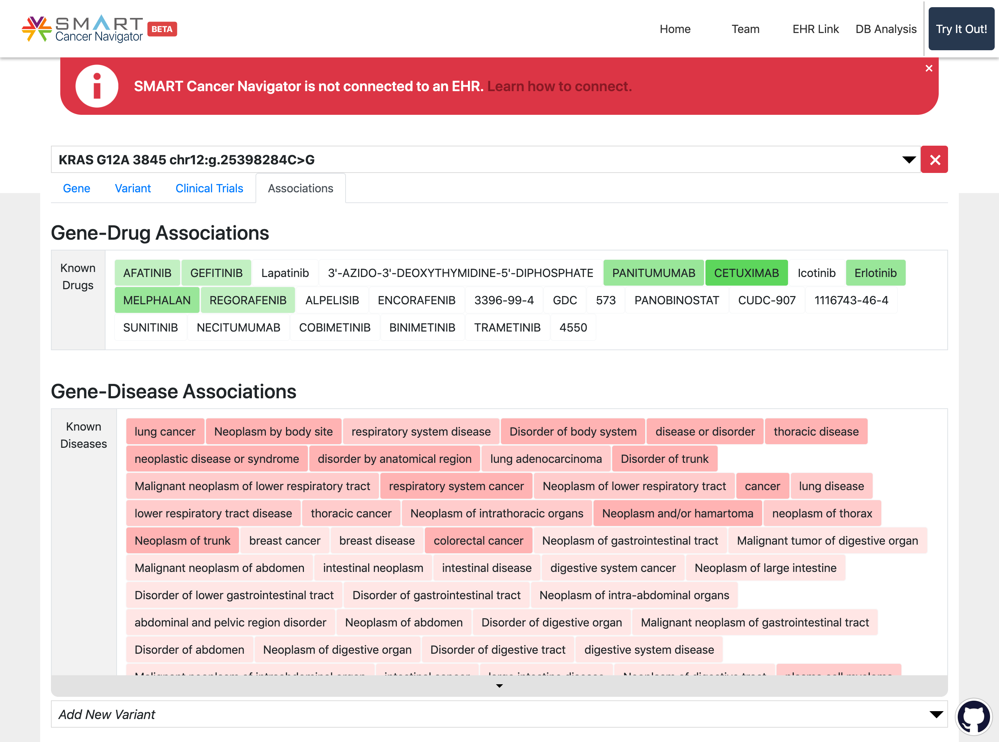
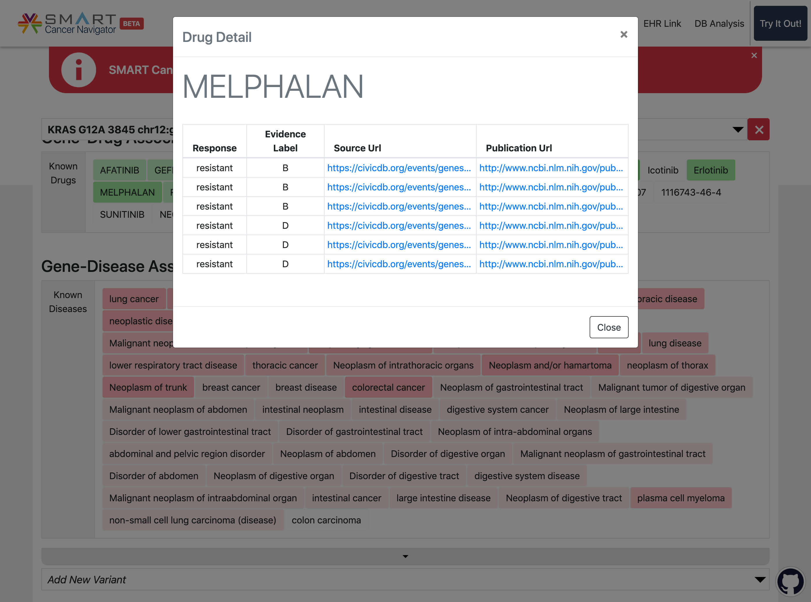

# The SMART Cancer Navigator Application

## About

SMART Cancer Navigator securely links patient-specific data from EHRs and genomics laboratories to multiple knowledge bases for interpretation and validation. Through the built-in feedback functionality, meaningful responses regarding the usability and efficacy of the app are conveyed to the designers. 

In a typical genomic non-SMART Cancer Navigator workflow, oncologists will prescribe a genomic analysis of a patient with a recurrent or metastatic tumor. Next, the genomics laboratory returns an unstructured narrative report relating a set of genes and the variants found in that set. Typically scanned into EHRs as PDF files, these reports persist as irregular unstructured documents of varying lengths. While some reports may be more than 20 pages in length – including characterizations of variants and gene abnormalities, potential targeted therapies, and relevant clinical trial info – others may be brief and without much interpretation. Facing a lack of clear actionability, potential biases in the curation of the reports, and outdated information, oncologists typically access and query several knowledge bases to obtain more comprehensive, up-to-date disease-gene-variant information. Therefore, oncologists must reenter patient data every time they wish to query a knowledge base. Inconsistencies among knowledge bases (i.e. differences in querying syntax, GUIs, APIs, etc.) thus lead to inconveniency and inefficiency. 


## Development Testing Instructions 
### Setting up the EHR
1. Create a new account on the [HSPC sandbox](sandbox.hspconsortium.org).  
2. Create a new sandbox from your HSPC account.  
3. Navigate to the Registered Apps tab on the left side of the page, and click 'register a new app manually'.  
4. Register the app values as launch: http://127.0.0.1:4200/smart-launch, and redirect uri(s): http://127.0.0.1:4200/token-reception
5. Create a new persona with the default practitioner (John Smith).  
6. Create a new launch scenario with a random patient and this new persona.  Link it to this newly registered app. 


### Running a local instance of SMART Cancer Navigator
1. ```cd``` to the cloned local [Application](https://github.com/smart-cancer-navigator/Application) repository on your local machine and run ```ng serve```.  
2. Launch your app by either navigating to [localhost:4200](http://localhost:4200), which provides no SMART context, or via the HSPC sandbox and launch it using your new launch scenario.  


### Deploying to Production
1. See the [smart-cancer-navigator.github.io](https://github.com/smart-cancer-navigator/smart-cancer-navigator.github.io) repository.

## My Work
1. Write a new service to query cancervariants.com based on the given hgvs_id.
2. Add a new association tab to visualize the results.

### screenshot


